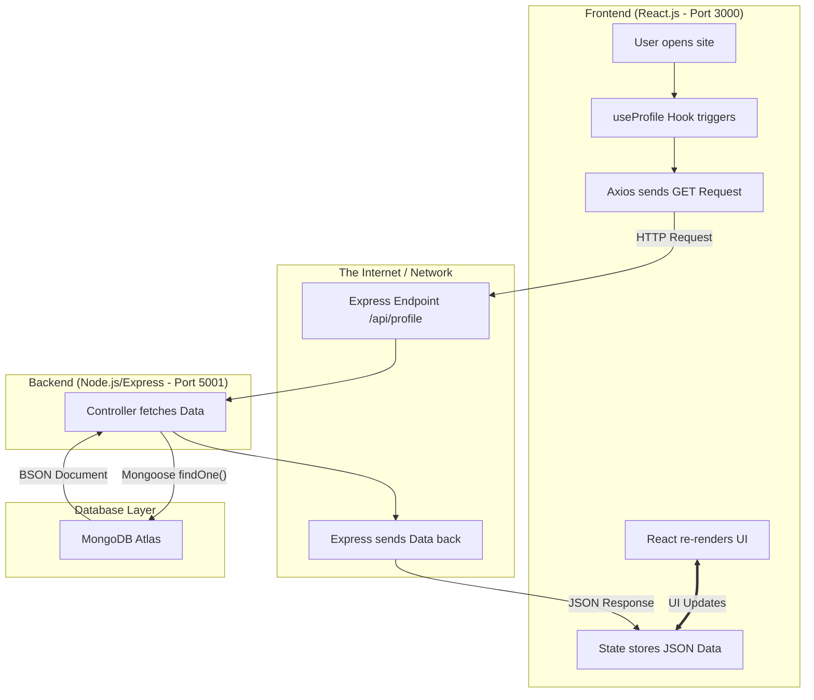

# 🚀 MERN Stack Project Architecture & Workflow

This document explains exactly how the **Backend** and **Frontend** are connected and the deep technical flow of your project.

---

## ❓ The Big Question: How do Two Separate Folders Connect?

You asked a very important question: *"How does the `server` folder connect to the `client` folder if they are two separate projects?"*

You are absolutely right—they ARE two completely different projects! 
- **`client`** is a React application running entirely in the user's **Web Browser**.
- **`server`** is a Node.js application running on a **Computer/Server** in the background.

**So how do they talk?** They don't share files or folders. They communicate over the **Network** (the internet or your local WiFi) using a universal language called **HTTP** (Hypertext Transfer Protocol).

### The Secret is in the "Ports"
Imagine your computer is a massive apartment building. 
- The `client` (React) lives in **Apartment 3000** (`localhost:3000`).
- The `server` (Node) lives in **Apartment 5001** (`localhost:5001`).

1. **The Request:** When someone opens the React site at Apartment 3000, React realizes it needs data. It picks up the phone (using **Axios**) and dials the number for exactly where the data lives: `http://localhost:5001/api/profile`. 
 *(This URL is defined in `client/src/config.js`!)*

2. **The CORS Door:** Normally, browsers are very strict. Being in Apartment 3000, the browser doesn't want to blindly trust Apartment 5001. This is a security measure. So, in the `server` folder, we installed `cors` (Cross-Origin Resource Sharing). This tells the Node server: *"Yes, requests from Apartment 3000 are safe, let them in!"*

3. **The Response:** The Node server looks up the DB, formats the answer, and sends a package containing purely text (JSON) back to React on the "phone".

They never touch each other's code. They simply send text messages back and forth through specific URLs and Ports!

---

This document explains exactly how the **Backend** and **Frontend** are connected and the deep technical flow of your project.

---

## 🏗️ 1. Project Architecture (MERN)
The project is built using the **MERN Stack**:
- **M**ongoDB: NoSQL Database to store your resume/portfolio data.
- **E**xpress.js: Backend framework to create APIs.
- **R**eact.js: Frontend library for the User Interface.
- **N**ode.js: The runtime environment that runs the backend.

---

## 🔗 2. Technical Data Flow (The Deep Dive)

Here is exactly how a single piece of data (like your "name") moves through the system:

### Phase 1: Storage (MongoDB Atlas)
Your data is stored in **MongoDB** as a **BSON** (Binary JSON) document. It stays there permanently until you update it.

### Phase 2: The API Bridge (Express.js)
The Backend is the "Gatekeeper" of your data.
1.  **Middleware**: When a request comes in, the `logger` middleware tracks it, and `cors` checks if the request is allowed.
2.  **Routing**: The request hits `/api/profile`.
3.  **Controller**: The `portfolioController.js` uses **Mongoose** (the translator) to talk to MongoDB. 
    `Profile.findOne()` is the command that retrieves the data.

### Phase 3: The Networking (Axios & HTTP)
The Frontend talks to the Backend via **HTTP Requests**.
- **Axios Instance**: In `services/api.js`, we create a specialized "caller" called `api`.
- **JSON Serialization**: The Backend sends the data as a string (JSON). The Frontend "parses" (converts) it back into a JavaScript object automatically.

### Phase 4: State Management (React Hooks)
This is where the magic happens on your screen.
1.  **`useProfile` Custom Hook**: This hook "observes" the API call.
2.  **`useState`**: Once the data arrives, we save it into a `state` variable. 
3.  **Re-rendering**: In React, when the `state` changes, the UI **instantly refreshes**. 
4.  **Mapping**: The data is passed as "props" to components like `Hero.js` or `Skills.js`.

---

## 📊 3. Visual Flowchart

---

## 📁 Why this structure?
- **Separation of Concerns**: The Frontend doesn't know how to talk to a database. It only knows how to talk to an **API**. This makes the project **secure**.
- **Scalability**: If you wanted to build a Mobile App (Android/iOS) later, it could use the **same Backend API** without changing anything!
- **Portability**: If your Database goes offline, the `portfolioController` is smart enough to switch to `data.json` automatically.

---

**Summary**: Your project is like a conversation. The Frontend asks questions (Requests), the Backend provides answers (Responses), and the Database stores the memories (Data).
