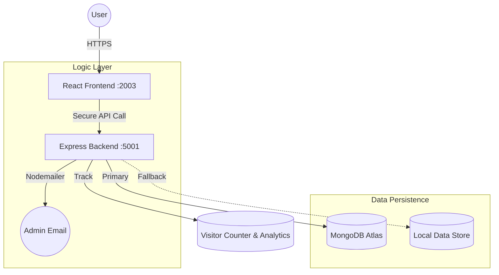

# 🚀 MERN Full-Stack Engineering Showcase
### Engineered by [A. Mohamed Yasar](https://github.com/mdyasar49)


---

## 💎 The Engineering Objective
This isn't just a portfolio; it's a **Production-Grade Simulation**. Most beginners build static sites; I engineered a decoupled system where the Frontend (React) and Backend (Node/Express) function as independent entities, communicating over a secure REST API. 

> **Goal:** To demonstrate architectural excellence, clean code practices, and a "User-First" design philosophy.

---

## 🛠️ Key Architectural Highlights

| Feature | Engineering Solution | Impact |
|:--- |:--- |:--- |
| **Data Resilience** | **Zero-Downtime Hybrid Layer**. Automatically switches between MongoDB Atlas (Primary) and `data.json` (Fallback). | Portfolio remains 100% functional even if MongoDB connectivity drops. |
| **Admin Control** | **Comprehensive Management Hub**. Real-time profile editing, system health monitoring, and proposal management via JWT authentication. | High-fidelity control over the entire ecosystem with secure, persistent updates. |
| **Interactive Analytics** | **Visual System Intelligence**. 7-day traffic density charts, device distribution, and geographic origin tracking. | Professional, data-driven insights into portfolio performance and audience engagement. |
| **Proposal Workflow** | **Architectural Refinement Protocol**. Guests can submit draft improvements which are dispatched to the admin via secure email alerts for approval. | Enables collaborative engineering while maintaining 100% administrative sovereignty. |
| **UX Innovation** | **Client-Side PDF Engine**. Bespoke resume generation using `html2pdf.js`. | Real-time PDF generation without server overhead. |
| **Elite Sharing** | **Smart Auto-Dispatch Protocol**. Browser-bound Gmail sharing with a `?system_dispatch` auto-download trigger. | Circumvents browser security blocks to provide seamless "virtual" file attachments via email. |
| **Multilingual** | **Dynamic Localization Engine**. Real-time Google Translate API integration with a custom Thanglish phonetic layer. | Documentation is accessible in English, Tamil, and Thanglish with 100% layout preservation. |

---

## 🏗️ System Architecture Overview



---

## 📁 Repository DNA
```text
mern-portfolio-yasar/
├── 🌐 client/               # React Interface (Standardized UI Components)
│   ├── src/hooks/           # Custom Logic (Telemetry, Analytics)
│   ├── src/services/        # API Consumer Layer (Axios)
│   ├── src/theme/           # Bespoke Design Tokens (MUI)
│   └── .env                 # Publicly Safe Global Config
└── ⚙️ server/               # Node.js Core (Business Logic)
    ├── controllers/         # Request Orchestration & Proposal Logic
    ├── services/            # Auxiliary Services (Email/Nodemailer)
    ├── middleware/          # Security & Global Error Handling
    └── data.json            # High-Availability Fallback Store
```

---

## 🚀 Rapid Deployment Guide

### 1. Engine Room (Backend)
```bash
cd server
npm install
# Create .env: PORT=5001, MONGO_URI, CLIENT_URL, NODE_ENV, EMAIL_USER, EMAIL_PASS
npm run dev
```

### 2. Control Deck (Frontend)
```bash
cd client
npm install
# Create .env: REACT_APP_API_BASE_URL=http://localhost:5001
npm start
```

---

## 📡 Core API Endpoints

| Method | Endpoint | Purpose | Intelligence |
|:--- |:--- |:--- |:--- |
| `GET` | `/api/profile` | Core Data | Supports DB/JSON failover. |
| `GET` | `/api/visitors`| Traffic Analytics | 7-day history & platform metrics. |
| `POST`| `/api/proposals/submit` | Guest Refinements | Dispatches email alerts to Admin. |
| `GET` | `/api/health`  | System Integrity | Monitors DB status & Memory usage. |

---

## 🚀 Performance & Optimization
*   **Tree Shaking:** Minimized bundle size by selectively importing MUI icons and components.
*   **Lazy Loading:** Implemented code splitting for the Resume engine to reduce initial bundle overhead.
*   **Memoization:** Used `React.memo` and `useMemo` in high-render components to maintain buttery-smooth performance.
*   **Dynamic Translation:** Implemented a custom `translateService` that handles Markdown structural preservation during machine translation.
*   **Copy Engine:** Integrated an asynchronous clipboard API with a visual feedback system (Framer Motion checkmark) for all technical code blocks.
*   **Proposal Protocol:** Engineered a secure administrative workflow where guest refinements are staged as pending proposals, requiring authenticated approval to merge into the live system.

---

## 🔮 Roadmap to v3.0
- [ ] **Dark/Light Mode Orchestration:** Advanced theme switching with persistent user preference.
- [ ] **AI-Powered Code Analysis:** Integrating LLM-based architectural explanations for all code blocks.
- [ ] **Enhanced Testing Suite:** Implementing Jest and Cypress for 100% core logic coverage.

---

## 🤝 Let's Connect
I am always looking for challenges that push the boundaries of what is possible on the web.

*   **GitHub:** [@mdyasar49](https://github.com/mdyasar49)
*   **LinkedIn:** [A. Mohamed Yasar](https://linkedin.com/in/mdyasar49)

---

*"Clean code is not just written; it's engineered."*
