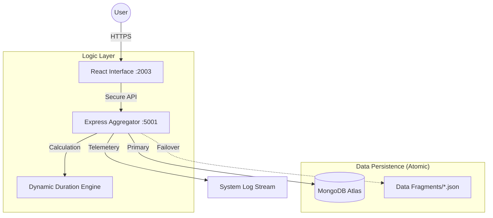

# 🚀 MERN Full-Stack Engineering Showcase (Data-Agnostic v4.2)
### Engineered by [Mohamed Yasar](https://github.com/mdyasar49)


---

## 💎 The Engineering Objective
This isn't just a portfolio; it's a **Zero-Hardcoding Production Framework**. Unlike traditional portfolios, this system is 100% data-driven. The frontend is a "dumb" presentation layer that consumes a highly sophisticated, atomized backend API. Every string, metric, and professional detail is dynamically calculated and injected at runtime.

> **Goal:** To demonstrate architectural decoupling, professional-grade security, and automated data integrity.

---

## 🛠️ Key Architectural Highlights

| Feature | Engineering Solution | Impact |
|:--- |:--- |:--- |
| **Atomic Data Pipeline** | **Fragmented JSON Architecture**. Portfolio content is split into 8 independent modules (`basic_info`, `skills`, `experience`, etc.) merged by a backend aggregation engine. | Extreme maintainability and structural clarity; updates require zero frontend code changes. |
| **Dynamic Calculation** | **Real-Time Duration Engine**. Professional tenure (Years/Months) is computed on-the-fly using a `careerStartDate` logic. | Guarantees 100% accuracy in professional metrics without manual updates. |
| **Security Perimeter** | **Hardened Production Shield**. Implements strict CORS whitelisting, Helmet (CSP), Rate Limiting, and a "Direct Access Shield" for API endpoints. | Enterprise-grade protection against XSS, DDoS, and information leakage. |
| **Holographic HUDs** | **Data-Driven Interface Modules**. Features specialized `DocumentationHUD` and `RecruiterHUD` that dynamically adapt based on backend telemetry. | Professional, recruiter-first presentation with real-time technical specifications. |
| **Data Resilience** | **Zero-Downtime Hybrid Layer**. Automatically falls back to the atomic JSON store if the MongoDB primary connection experiences latency. | Ensures the portfolio remains 100% functional and production-ready at all times. |

---

## 🏗️ System Architecture Overview



---

## 📁 Repository DNA
```text
mern-portfolio-yasar/
├── 🌐 client/               # React Presentation Layer (Zero Hardcoding)
│   ├── src/components/      # Data-Consuming HUDs, HUD Containers, HUD Logic
│   ├── src/pages/           # Dynamic Assemblers (Portfolio, Resume)
│   └── src/config.js        # Environment-Aware API Bridge
└── ⚙️ server/               # Node.js Data Engine (Business Logic)
    ├── controllers/         # Atomic Aggregator & Duration Logic
    ├── data/                # Specialized Data Fragments (JSON Modules)
    ├── middleware/          # Security (CORS, Helmet, RateLimit, Direct-Shield)
    └── app.js               # Production-Grade Middleware Pipeline
```

---

## 🚀 Rapid Deployment Guide

### 1. Backend Engine
```bash
cd server
npm install
# Create .env: PORT=5001, MONGO_URI, CLIENT_URL, NODE_ENV=production, EMAIL_USER, EMAIL_PASS
npm run dev
```

### 2. Frontend Interface
```bash
cd client
npm install
# Create .env: REACT_APP_API_BASE_URL (Optional in Production)
npm start
```

---

## 📡 Core API Endpoints

| Method | Endpoint | Purpose | Intelligence |
|:--- |:--- |:--- |:--- |
- [ ] **Enhanced Testing Suite:** Implementing Jest and Cypress for 100% core logic coverage.

---

## 🤝 Let's Connect
I am always looking for challenges that push the boundaries of what is possible on the web.

*   **GitHub:** [@mdyasar49](https://github.com/mdyasar49)
*   **LinkedIn:** [Mohamed Yasar](https://linkedin.com/in/mdyasar49)

---

*"Clean code is not just written; it's engineered."*
