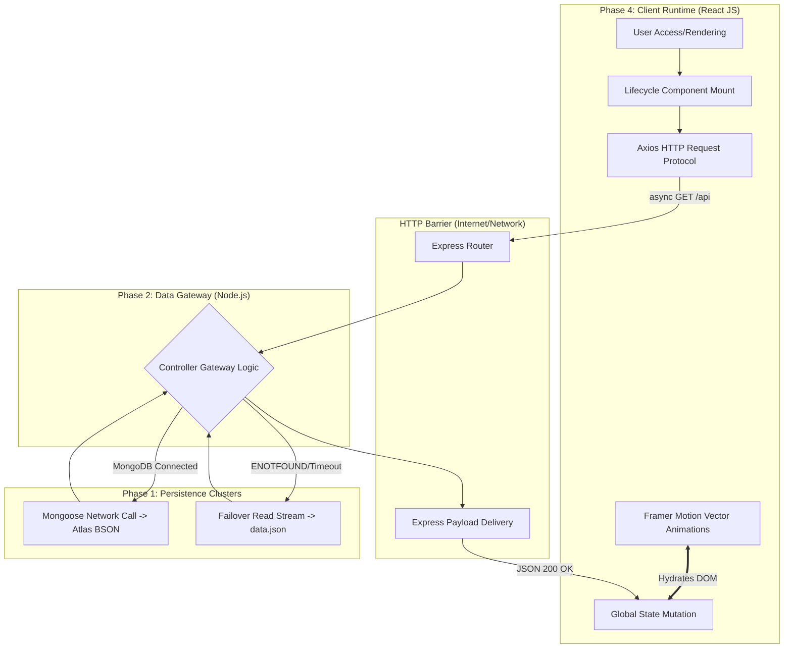

# 🛸 Full Stack Software Architecture & Engineering Principles

This document serves as the top-level technical briefing for the `Kinetic 3D Full Stack Portfolio`. It outlines the complex interplay between the distributed environment layers, component rendering pipelines, and the data orchestration strategies employed in this repository.

---

## ❓ The Big Question: How do Two Separate Folders Connect?

You asked a very important question: *"How does the `server` folder connect to the `client` folder if they are two separate projects?"*

You are absolutely right—they ARE two completely different projects! 
- **`client`** is a React application running entirely in the user's **Web Browser**.
- **`server`** is a Node.js application running on a **Computer/Server** in the background.

**So how do they talk?** They don't share files or folders. They communicate over the **Network** (the internet or your local WiFi) using a universal language called **HTTP** (Hypertext Transfer Protocol).

### The Secret is in the "Ports"
Imagine your computer is a massive apartment building. 
- The `client` (React) lives in **Apartment 3000** (`localhost:3000`).
- The `server` (Node) lives in **Apartment 5001** (`localhost:5001`).

1. **The Request:** When someone opens the React site at Apartment 3000, React realizes it needs data. It picks up the phone (using **Axios**) and dials the number for exactly where the data lives: `http://localhost:5001/api/profile`. 
 *(This URL is defined in `client/src/config.js`!)*

2. **The CORS Door:** Normally, browsers are very strict. Being in Apartment 3000, the browser doesn't want to blindly trust Apartment 5001. This is a security measure. So, in the `server` folder, we installed `cors` (Cross-Origin Resource Sharing). This tells the Node server: *"Yes, requests from Apartment 3000 are safe, let them in!"*

3. **The Response:** The Node server looks up the DB, formats the answer, and sends a package containing purely text (JSON) back to React on the "phone".

They never touch each other's code. They simply send text messages back and forth through specific URLs and Ports!

---

## 🏗️ 1. Distributed Micro-Environment Architecture

The system operates strictly across two mathematically isolated computational environments that communicate solely via HTTP/REST protocol:

- **The Visualization Layer (`client`)**: A React 18 single-page application executing dynamically inside the V8 engine of the user's browser. It mathematically calculates layout properties, 3D mouse vector physics via Framer Motion, and maintains DOM states.
- **The Telemetry & Orchestration Layer (`server`)**: A Node.js/Express.js gateway hosted entirely separately on a dedicated backend server logic block. It functions strictly to handle incoming API queries, authenticate network routes, and query the persistence clusters.

### The Port/CORS Security Handshake
Because modern browsers strictly sandbox cross-origin data (`localhost:3000` speaking to `localhost:5001`), the `server` implements **CORS** middleware logic to explicitly whitelist origins. React requests data via Axios async instances, to which the backend responds with heavily optimized JSON payloads. Absolutely no logic or rendering code is shared between the two layers.

---

## 🔗 2. Technical Data Telemetry Flow

The data transaction pipeline is composed using a robust **Controller-Service-Middleware** design pattern structure.

### Phase 1: Fail-Safe Data Cluster (MongoDB Atlas / JSON Engine)
Data originates as structured BSON objects within the MongoDB Atlas Cloud. Crucially, the system features a **Portable Mode Fallback Mechanism**. If DNS failures or cluster connection timeouts (`ENOTFOUND`) occur during server boot, the system instantly catches the exception and falls back to a locally cached `data.json` replica, ensuring **zero downtime**. 

### Phase 2: Gateway Triage (Express.js)
1. **Request Interception**: Incoming `GET` requests to `/api/profile` are intercepted.
2. **Controller Logic**: `portfolioController.js` acts as the business logic orchestrator, deciding whether to serve Mongoose cluster data or standard schema-matched JSON cache models depending on the current network node statuses.

### Phase 3: The Front-Facing Resolution (Axios Layer)
The `client` initiates the fetch using a strictly centralized configuration environment (`config.js`). It actively listens to the environment variable `REACT_APP_API_BASE_URL` to flawlessly transition between local development nodes (`localhost:5001`) and production deployments on Render.

### Phase 4: Dynamic Rehydration (React Virtual DOM)
Upon data reception:
1. React unmounts the fallback UI Loading spinners.
2. High-performance custom hooks push the parsed JSON payload into component `state`.
3. The Virtual DOM calculates the differential UI components required, aggressively injecting the state across the *Hero*, *Skills*, *Experience*, and *Resume* interfaces.

---

## 📊 3. Topological Flow Protocol

---

## 📁 Engineering Rationale

- **Network Safety via Separation**: The React runtime literally never possesses database passwords or queries. It only ever processes structured REST outputs.
- **Chameleon Capabilities**: Separating concerns means the UI rendering engine is entirely disposable. The JSON backend can serve a Mobile App, a CLI tool, or a Smart Device identically.
- **Failover Logic Development**: Enterprise systems prioritize uptime over pure features. The architectural decision to gracefully transition between a live database and a static fallback proves deep resilience engineering experience.

