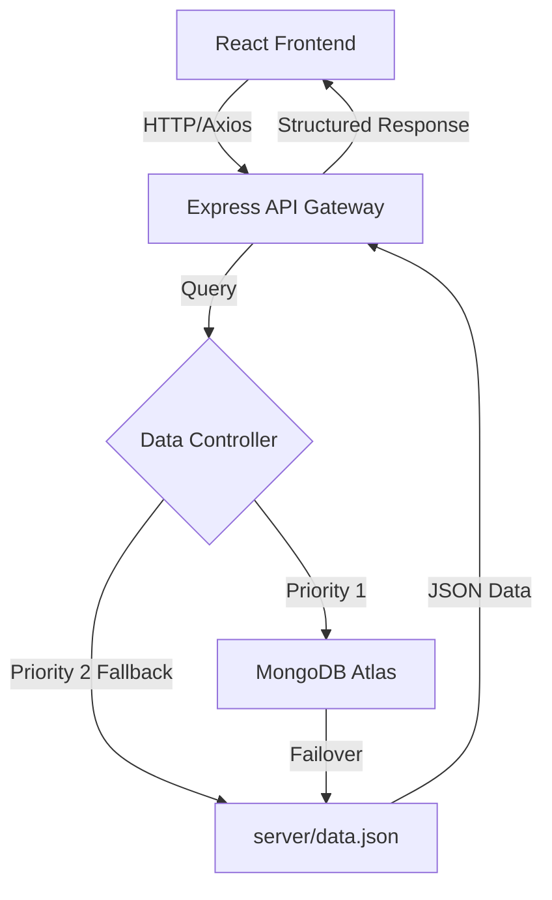

# 🏗 DEEP SYSTEM ARCHITECTURE: MISSION CONTROL
## *MERN Portfolio Technical Blueprint & Data Flow*

This document provides a comprehensive technical breakdown of the **MERN Elite Portfolio v2.0**. It details the interaction between the distributed layers and the logic behind the "Modular Performance" architecture.

---

### 📡 1. High-Level Communication Flow
The application follows a standard **MERN (MongoDB, Express, React, Node)** pattern but integrates a **Local Data Sync Hybrid** (LDSH) strategy for maximum uptime.

#### **How it works:**
1. **Request**: The React client requests data (About, Skills, Resume).
2. **Control**: The Node server receives the request and checks the connection health of MongoDB.
3. **Resolve**: If MongoDB is unreachable (Dev mode or DB maintenance), the server intelligently serves data from `data.json`.
4. **Consistency**: Both sources share the exact same schema, ensuring the frontend never breaks.

---

### 🎨 2. The Premium Design System
The UI is not just a layout; it's a meticulously crafted **Cyber-Modern Design System**.

- **Typography Strategy**: Uses *Syncopate* for headers (Robotic/Futuristic) and *Outfit/Inter* for body text (Professional/Clean).
- **Glassmorphism 2.0**: Implemented via a custom `glass-panel` class using `backdrop-filter: blur(20px)` and semi-transparent borders to simulate depth.
- **Micro-Interactions**: Leverages `Framer Motion` for gesture-based animations (Hover scales, Tap expansions, and list staggers).

---

### 📑 3. The Modular Resume Engine
This is a standout feature designed to bridge the gap between a web profile and a physical document.

| Module | Responsibility |
| :--- | :--- |
| **Logic Layer** | `client/public/resume-pro/js/script.js` |
| **Rendering** | Injected HTML fragments into a hidden iframe. |
| **Export Engine** | `html2pdf.js` library for client-side PDF generation. |
| **Print-Spec** | Specialized `@media print` CSS for standard A4 compliance. |

**The Workflow**:
`React Component` -> `Trigger Iframe Load` -> `Fetch Server Data` -> `Render Modular HTML` -> `Generate PDF Blob` -> `Auto Download`.

---

### 🛡 4. Production Scalability & Security
- **Backend Hardening**: Uses Express middleware to handle JSON parsing and CORS (Cross-Origin Resource Sharing) restrictions.
- **SEO DNA**: Every page is wrapped in a dedicated `SEO.js` component which dynamically injects meta tags, ensuring maximum visibility on Google/LinkedIn.
- **Modular Build**: The project is split into clean directories:
    - `client/src/components`: Atomic UI elements.
    - `client/src/pages`: High-level route containers.
    - `server/controllers`: Pure business logic.

---

### 🎯 5. Conclusion
The **MERN Portfolio v2.0** reflects a philosophy of "Simple at first glance, complex under the hood." By combining a hybrid data layer with a modular resume engine, it achieves a level of polish and reliability found in enterprise-grade SaaS products.

---
*Documentation Version: 2.1.0*
*Last Calibration: 2026*
